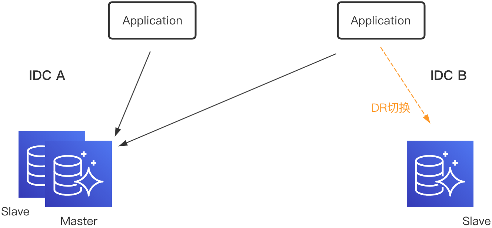
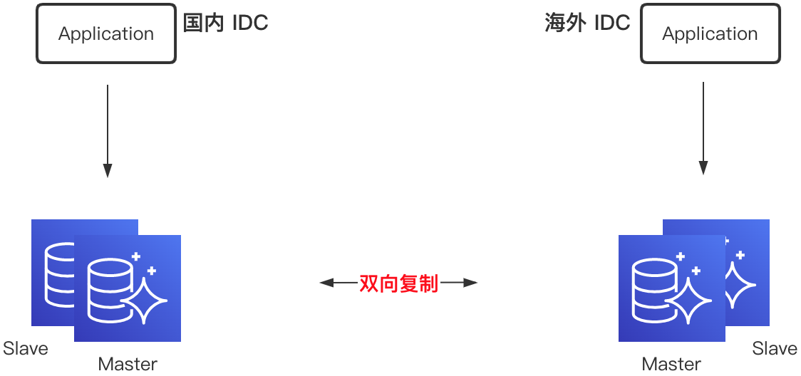
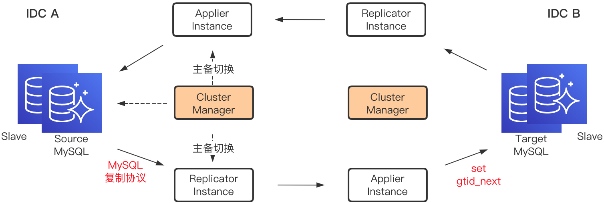

# DRC

# Introduction
DRC(Data Replicate Center)是携程框架架构研发部数据中心组推出的用于数据双向或多向复制的数据库中间件，服务于异地多活项目，同时赋予了业务全球化的部署能力。

携程内部MySQL采用多机房部署，机房A部署一主一从，机房B部署一从，作为DR(Disaster Recovery)切换使用。当前部署下，机房B部署的应用需要跨机房进行写操作；当机房A出现故障时，DBA需要手动对数据库进行DR切换。
为了做到真正的数据异地多活，实现MySQL同机房就近读写，机房故障时无需进行数据库DR操作，只进行流量切换，就需要引入数据实时双向(多向)复制组件。

    

同时在国际化战略背景下，业务出海时伴随着数据出海，就需要海外和国内数据复制，从而实现数据的本地读写。

    

# Screenshots

# Usage
1.[console guide](/docs/zh/usage/drc_console.md)
# Features
* **表粒度复制**
  * 默认集群粒度复制，可指定正则表达式，精确到表粒度。
  
* **一对多复制**
  * 多个Applier消费同一个Replicator，每个Applier独立消费。
  
* **公有云复制**
  * 支持AWS、阿里云等公有云和私有云双向复制。
  
* **断点续传**
  * DRC根据gtid精确定位Binlog位点。

* **表结构变更**
  * DRC支持表结构动态连续变更，保证数据准确性。
  
* **故障自动切换**
  * 核心模块Replicator、Applier和Cluster Cluster均通过Zookeeper实现主备架构，单点故障自动切换。

# Design
整体架构如下所示：  

    

  - Replicator：Replicator Instance表示一个MySQL集群的复制单元，Instance将自己伪装为MySQL的Slave，实现Binlog的拉取和本地文件存储。 
  - Applier：Applier Instance连接到一个Replicator Instance，实现对Replicator Instance本地存储Binlog的拉取，进而解析出SQL语句并应用到目标MySQL，从而实现数据的复制。 
  - Cluster Manager：负责集群高可用切换，包括由于MySQL主从切换导致的Replicator Instance和Applier Instance重启，以及Replicator Instance与Applier Instance自身主从切换引起的新实例启动通知。

  
# Deployment
  - [Quick Start](docs/zh/deployment/quick-start.md)

# Presentation
  * [异地多活-携程MySQL实时双向(多向)复制](docs/_files/异地多活-携程MySQL实时双向(多向)复制.pdf)

# Publication
  * [携程海外MySQL数据复制实践](https://mp.weixin.qq.com/s/Yd3yqkdDCnK1EBIwpacaYw)
  * [携程异地多活-MySQL实时双向（多向）复制实践](https://mp.weixin.qq.com/s/_CYE1MGUeyFCn5lpcdklDg)
