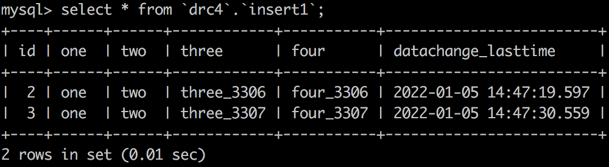

# 准备工作

## Java

* JDK 11+，使用ZGC。

## 代码编译
- 清空本地 maven 仓库的 com 和 org 目录；
- DRC 所有携程相关的 maven 依赖放置在项目 mvn_repo 分支下；
```
 git checkout mvn_repo
```
在 drc 目录下, 运行 sh install.sh, 自动将非公共 maven 仓库的依赖装载在本地 maven 系统中；
- 编译代码
```
 mvn clean install -Ppackage,local
```

## Docker

```txt
brew install --cask --appdir=/Applications docker 
```

## MySQL

* MySQL镜像，要求：5.7.22+。

```txt
docker pull mysql:5.7
```

# 启动双向复制

本地集成测试以 com.ctrip.framework.drc.monitor.BidirectionalStarter 单元测试启动，仅依赖外部Docker实例启动的MySQL实例，实现单实例版数据库双向复制。
默认会启动2个docker MySQL实例，分别使用3306和3307端口，每个单向复制启动一对Replicator Instance和Applier Instance。

## 双向复制验证

通过本地安装(自行安装)的mysql客户端，连接MySQL实例，模仿业务写入:

向3306实例插入一条数据：
```txt
mysql -h 127.0.0.1 -P 3306 -u root -proot
insert into `drc4`.`insert1`(`three`, `four`) values("three_3306", "four_3306");
```
向3307实例插入一条数据：
```
mysql -h 127.0.0.1 -P 3307 -u root -proot
insert into `drc4`.`insert1`(`three`, `four`) values("three_3307", "four_3307");
```

此时2边MySQL实例经过底层双向复制，会同时存在2条数据：



## 数据存储
本地集成测试默认将数据存储在 /tmp 路径下，可使用 mysqlbinlog 查看binlog文件内容。
由于文件中保存了DRC自定义的事件，需要加 -f 选项。
```
mysqlbinlog -vvf rbinlog.0000000001
```